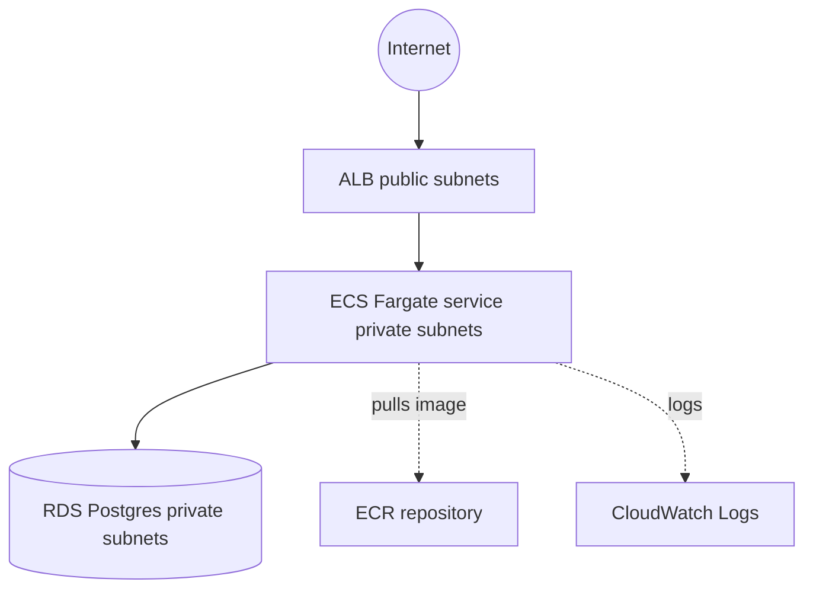

# Web App Platform (reference architecture)

End-to-end, runnable reference stack that composes the library modules into a
single deployable platform for a containerized web application with a managed
database.

## What it deploys

- **VPC** with public and private subnets across two AZs and a NAT gateway
- **Three security groups**: public ALB, private service, private database
- **ECR** repository for the application image
- **Application Load Balancer** (public) forwarding HTTP to the service
- **ECS Fargate** service running the container in private subnets, registered
  with the ALB target group by IP, logging to CloudWatch
- **IAM** task execution and task roles for the service
- **RDS Postgres** instance in private subnets, encrypted, not publicly accessible

## Architecture



## Prerequisites

- Terraform >= 1.6.0
- AWS credentials with permissions for VPC, ECS, ECR, RDS, ELB, IAM, CloudWatch
- A container image (defaults to a public nginx image so the stack runs before
  you push your own to the created ECR repository)

## Usage

```bash
cp terraform.tfvars.example terraform.tfvars
# edit values; supply the DB password out of band:
export TF_VAR_db_password='your-strong-password'

terraform init
terraform plan
terraform apply
```

After apply, browse to the `alb_dns_name` output. Push your image to the
`ecr_repository_url` output and update `container_image` to roll it out.

## Inputs

| Name | Type | Default | Description |
|------|------|---------|-------------|
| `region` | string | `us-east-1` | AWS region |
| `name` | string | `platform-web-app` | Base name for all resources |
| `cidr_block` | string | `10.0.0.0/16` | VPC CIDR |
| `azs` | list(string) | two `us-east-1` AZs | Availability zones |
| `public_subnet_cidrs` | list(string) | two /24s | Public subnet CIDRs (ALB) |
| `private_subnet_cidrs` | list(string) | two /24s | Private subnet CIDRs (tasks, DB) |
| `container_image` | string | public nginx | Image the service runs |
| `container_port` | number | `80` | Container listen port |
| `desired_count` | number | `2` | Number of tasks |
| `task_cpu` / `task_memory` | string | `512` / `1024` | Fargate task size |
| `health_check_path` | string | `/` | ALB health check path |
| `db_name` / `db_username` | string | `appdb` / `appuser` | Postgres database and user |
| `db_password` | string (sensitive) | required | Postgres master password |
| `db_instance_class` | string | `db.t3.micro` | RDS instance class |
| `tags` | map(string) | project tags | Tags applied to all resources |

## Outputs

| Name | Description |
|------|-------------|
| `alb_dns_name` | Public DNS name of the load balancer |
| `ecr_repository_url` | Repository URL to push images to |
| `ecs_cluster_arn` | ECS cluster ARN |
| `rds_endpoint` | Postgres connection endpoint |
| `vpc_id` | VPC ID |

## Cost note

This stack runs billable resources (NAT gateway, ALB, RDS, Fargate tasks).
Estimated cost risk: **High**. Run `terraform destroy` when you are done.
